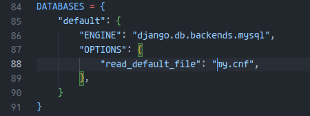
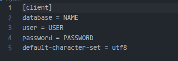
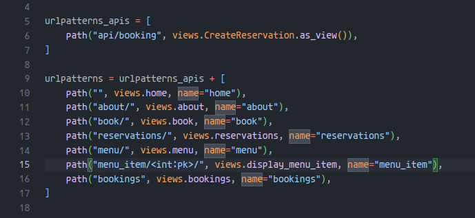
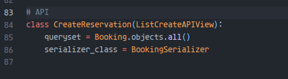
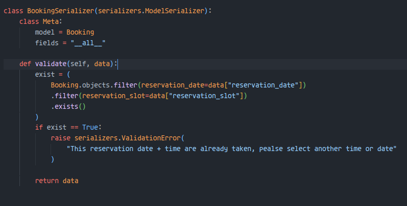
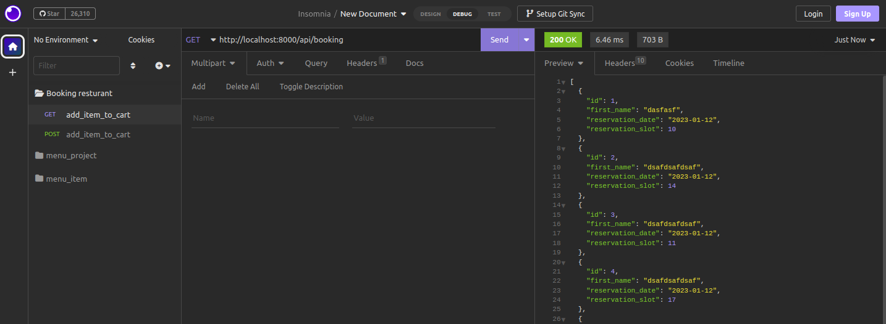
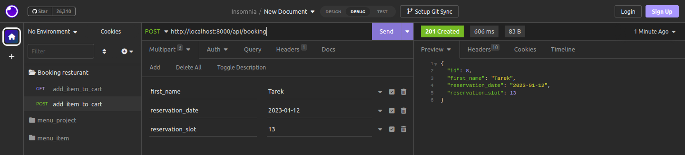
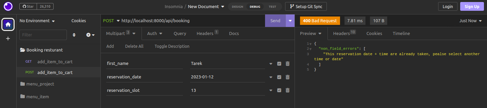

This is my Implemntation of my  **final project assessment**
## Connect the Little Lemon restaurant back-end to MySQL 

this my configuration for my django project to integrate MySQL database

 

I used external environment (`my.cnf`) to store all requirement properties

## Set up a Little Lemon restaurant booking API 
### seting up urls.py for resturant app

## Insert booking data in the database via the  booking API
### View for Booking API

### Serializer with validation for existed data

## Testing API
### Get List of all reservations

### Add new reservation

### Add existing reservation

